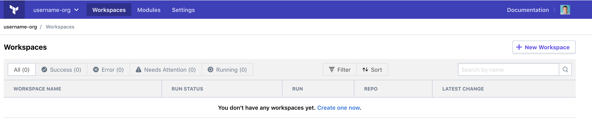

# Connecting To Terraform Enterprise

## Expected Outcome

You will create a user and then be granted access to a Terraform Organization for labs later in the week.

## How To

### Create an Account

Navigate to: <https://cmm-training.digitalinnovation.dev/account/new>

Fill out the fields, your username and email must be unique.

> Note: Your will not receive any emails from this training instance of TFE.

Once you have created an account, let the instructor know.

### Organization Access

Once the instructor has created your organization, refresh your browser and you should see an organization available.

DONE!

More to come in the next few days.
