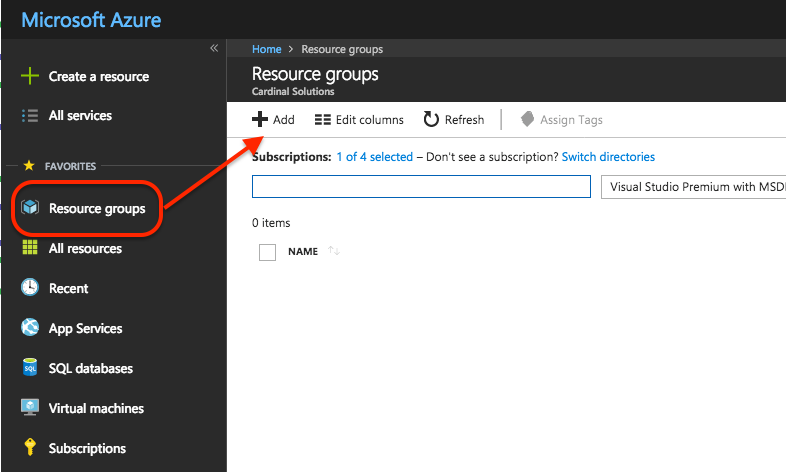
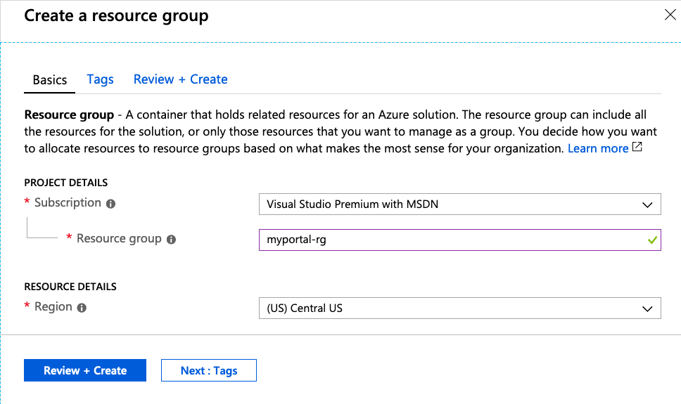
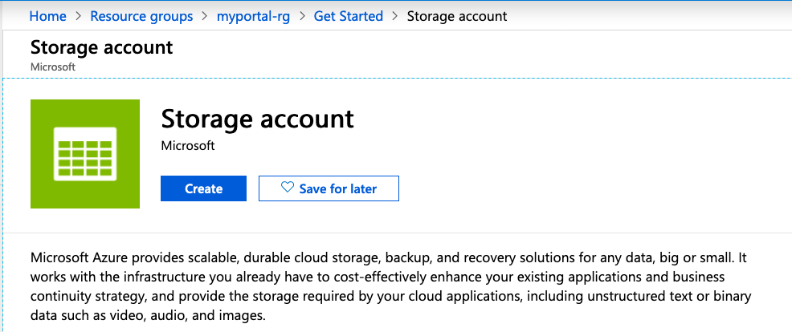
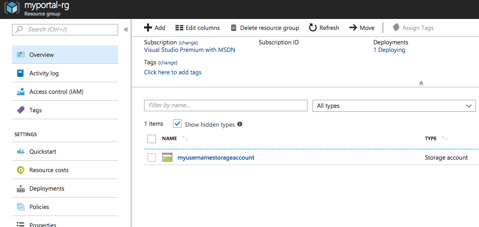

# Connecting To Azure

## Expected Outcome

You will use Terraform to create simple infrastructure in your Azure Subscription.

In this challenge, you will:

- Initialize Terraform
- Run a `plan` on simple a simple resource
- Run an `apply` to create Azure infrastructure
- Run a `destroy` to remove Azure infrastructure

## How To

### Create Terraform Configuration

Change directory into a folder specific to this challenge.

For example: `cd ~/TerraformWorkshop/101-import/`.

Create an empty file named `main.tf`.

---

## How To

> NOTE: It is critical that you chose a unique PREFIX if you are in a shared Azure Subscription. Below if you see "myportal-rg", add a prefix to make the name unique (Example: "tstraub-myportal-rg).

### Create Infrastructure in the Portal

Navigate to the Azure Portal and click on the "Resource groups" item on the left side and then click  "+ Add":



In the Resource Group create blade give the resource group the name "myportal-rg" and click "Review + Create" -> "Create":



Once the Resource Group is created, navigate to it.

Find the "+ Add" button and click it:


Search for "Storage Account" and click the first item and then click "Create" :



In the Storage Account create blade, fill out the following:

- Subscription = Use the current subscription
- Resource Group = Use Existing and select "myportal-rg"
- Name = Must be a unique name, there will be a green checkmark that shows up in the text box if your name is available. Example "<YOURUSERNAME>storageaccount"
- Location = Central US
- Performance = Standard
- Account Kind = Storage V2
- Replication = LRS
- Access Tier = Hot


Click "Review + Create" -> "Create".

At this point we have a Resource Group and a Storage Account and are ready to import this into Terraform.



### Create Terraform Configuration

Your Azure Cloud Shell should still be in the folder for this challenge with a single `main.tf` file.
We will now add `resource` blocks to represent the infrastructure we are about to import.

We have two resources we need to import into our Terraform Configuration, to do this we need to do two things:

1. Create the base Terraform configuration for both resources.
2. Run `terraform import` to bring the infrastructure into our state file.

To create the base configuration place the following code into the `main.tf` file.

```hcl
provider "azurerm" {
  features {}
}

resource "azurerm_resource_group" "import" {
  name     = "myportal-rg"
  location = "centralus"
}

resource "azurerm_storage_account" "import" {
  name                      = "myusernamestorageaccount"
  resource_group_name       = azurerm_resource_group.import.name
  location                  = "centralus"
  account_kind              = "StorageV2"
  account_tier              = "Standard"
  account_replication_type  = "LRS"
  enable_https_traffic_only = true
}
```

`terraform init`

`terraform plan`

Shows 2 to add

```sh
Terraform will perform the following actions:

  + azurerm_resource_group.main
      id:                               <computed>
      location:                         "centralus"
      name:                             "myportal-rg"
      tags.%:                           <computed>

  + azurerm_storage_account.main
      id:                               <computed>
      access_tier:                      <computed>
      account_encryption_source:        "Microsoft.Storage"
      account_kind:                     "Storage"
      account_replication_type:         "LRS"
      account_tier:                     "Standard"
      enable_blob_encryption:           <computed>
      enable_file_encryption:           <computed>
      location:                         "centralus"
      name:                             "myusernamestorageaccount"
      primary_access_key:               <computed>
      primary_blob_connection_string:   <computed>
      primary_blob_endpoint:            <computed>
      primary_connection_string:        <computed>
      primary_file_endpoint:            <computed>
      primary_location:                 <computed>
      primary_queue_endpoint:           <computed>
      primary_table_endpoint:           <computed>
      resource_group_name:              "myportal-rg"
      secondary_access_key:             <computed>
      secondary_blob_connection_string: <computed>
      secondary_blob_endpoint:          <computed>
      secondary_connection_string:      <computed>
      secondary_location:               <computed>
      secondary_queue_endpoint:         <computed>
      secondary_table_endpoint:         <computed>
      tags.%:                           <computed>


Plan: 2 to add, 0 to change, 0 to destroy.
```

> CAUTION: This is not what we want!

### Import the Resource Group

We need two values to run the `terraform import` command:

1. Resource Address from our configuration
1. Azure Resource ID

The Resource Address is simple enough, based on the configuration above it is simply "azurerm_resource_group.main".

The Azure Resource ID can be retrieved using the Azure CLI by running `az group show -g myportal-rg --query id`. The value should look something like "/subscriptions/xxxxxx-xxxx-xxxx-xxxx-xxxxxxxxxxxx/resourceGroups/myportal-rg".

Now run the import command:

```sh
$ terraform import azurerm_resource_group.import /subscriptions/xxxxxx-xxxx-xxxx-xxxx-xxxxxxxxxxxx/resourceGroups/myportal-rg

Import successful!

The resources that were imported are shown above. These resources are now in
your Terraform state and will henceforth be managed by Terraform.
```

### Import the Storage Account

The process here is the same.

The Resource Address is simple enough, based on the configuration above it is simply "azurerm_storage_account.main".

The Azure Resource ID can be retrieved using the Azure CLI by running `az storage account show -g myportal-rg -n myusernamestorageaccount --query id`. The value should look something like "/subscriptions/xxxxxx-xxxx-xxxx-xxxx-xxxxxxxxxxxx/resourceGroups/myportal-rg/providers/Microsoft.Storage/storageAccounts/myusernamestorageaccount".

```sh
$ terraform import azurerm_storage_account.import /subscriptions/xxxxxx-xxxx-xxxx-xxxx-xxxxxxxxxxxx/resourceGroups/myportal-rg/providers/Microsoft.Storage/storageAccounts/myusernamestorageaccount

Import successful!

The resources that were imported are shown above. These resources are now in
your Terraform state and will henceforth be managed by Terraform.
```

### Verify Plan

Run a `terraform plan`, you should see no changes:

```sh
$ terraform plan

...

No changes. Infrastructure is up-to-date.

This means that Terraform did not detect any differences between your
configuration and real physical resources that exist. As a result, no
actions need to be performed.
```

### Make a Change

Add the following tag configuration to both the Resource Group and the Storage Account:

```hcl
resource "azurerm_resource_group" "import" {
  ...
  tags = {
    terraform = "true"
  }
}

resource "azurerm_storage_account" "import" {
  ...
  tags = {
    terraform = "true"
  }
}
```

Run a plan, we should see two changes.

```sh
  ~ azurerm_resource_group.import
      tags.%:         "0" => "1"
      tags.terraform: "" => "true"

  ~ azurerm_storage_account.import
      tags.%:         "0" => "1"
      tags.terraform: "" => "true"


Plan: 0 to add, 2 to change, 0 to destroy.
```

Run `terraform apply`.

SUCCESS! You have now brought existing infrastructure into Terraform.

### Cleanup

When you are done, destroy the infrastructure, you no longer need it.

```sh
$ terraform destroy
azurerm_resource_group.main: Refreshing state... (ID: /subscriptions/.../resourceGroups/challenge01-rg)
azurerm_resource_group.import: Refreshing state... (ID: /subscriptions/.../resourceGroups/myportal-rg)
azurerm_storage_account.import: Refreshing state... (ID: /subscriptions/.../storageAccounts/myusernamestorageaccount)

An execution plan has been generated and is shown below.
Resource actions are indicated with the following symbols:
  - destroy

Terraform will perform the following actions:

  - azurerm_resource_group.import

  - azurerm_storage_account.import


Plan: 0 to add, 0 to change, 2 to destroy.

Do you really want to destroy all resources?
  Terraform will destroy all your managed infrastructure, as shown above.
  There is no undo. Only 'yes' will be accepted to confirm.clear

  Enter a value: yes

...

azurerm_resource_group.main: Destruction complete after 45s
azurerm_resource_group.import: Destruction complete after 46s

Destroy complete! Resources: 2 destroyed.
```

Because the infrastructure is now managed by Terraform, we can destroy just like before.

Run a `terraform destroy` and follow the prompts to remove the infrastructure.

## Advanced areas to explore

1. Play around with adjusting the `count` and `name` parameters, then running `plan` and `apply`.
2. Run the `plan` command with the `-out` option and apply that output.
3. Add tags to each resource.

## Resources

- [Terraform Count](https://www.terraform.io/docs/configuration/interpolation.html#count-information)
- [Terraform Import](https://www.terraform.io/docs/commands/import.html)
