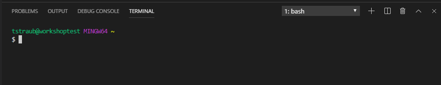

# Workstation Configuration

In this lab you will install all the tooling on your local machine.

> NOTE: If you are using windows, it is advised that you use the git-bash terminal to execute the workshop commands.

## How to (All)

Perform these steps regardless of platform.

### Download Visual Studio Code

You can Download the latest version here:

<https://code.visualstudio.com/Download>


> Be sure to check the box "Add to PATH" when installing, this will make launching vscode possible from the command line.

Open VSCode:


## How to (Windows)

### Install Chocolatey

Chocalatey is a package manager for Windows and will make installing the pre-requisites easier on Windows.

You can install Chocolatey simply by running the following command:

`Set-ExecutionPolicy Bypass -Scope Process -Force; iex ((New-Object System.Net.WebClient).DownloadString('https://chocolatey.org/install.ps1'))`

Further information is available here if needed:

<https://chocolatey.org/docs/installation>

Close your shell and reopen.

Ensure you can run the `choco` command:

```sh
$ choco
Chocolatey v0.10.15
Please run 'choco -?' or 'choco <command> -?' for help menu.
```

### Download Git, Azure CLI, and Terraform

Run the following to install everything in order:

```sh
choco install -y git azure-cli terraform
```

> Note: If you are having issues with one of these installing, run them individually to identify which is causing the issue.

### Download Sentinel Simulator

Download can be found here:

<https://docs.hashicorp.com/sentinel/downloads.html>

Select the Windows -> 64-bit version.

This will download a zip file, extract it and copy to your `$HOME/bin` directory, this will ensure we can reach it easily from the command line.

> Note: Your `$HOME/bin` directory is typically "C:\Users\USERNAME\bin".

### Verify Installations

Verify you can run the following commands, with the appropriate results:

**git**
```sh
$ git --version
git version 2.22.0.windows.1
```

**azure cli**
```sh
$ az -v
azure-cli                         2.0.71

...other dependencies and information...

Legal docs and information: aka.ms/AzureCliLegal

Your CLI is up-to-date.
```

**terraform**
```sh
$ terraform -v
Terraform v0.12.6
```

**sentinel**
```sh
$ sentinel -v
Sentinel Simulator v0.10.4
```

### Set VSCode to use git-bash

Open VSCode.

In the top menu select "View" -> "Terminal", this will open an integrated terminal.
This Terminal is where you will perform all of your tasks for the workshops.

> Alternatively you can use the keyboard shortcut "Ctrl + `"

Once the Integrated Terminal is open, click the dropdown to "Select Default Shell".


This will open the option to select your preferred terminal, select "Git Bash":


Remove your current terminal by clicking the trash can icon, then relaunch the Integrated Terminal.
You should now see something like this:




## How to (Mac)

### Upgrade `brew`

Run `brew update` to ensure you have access to packages.

### Download Git, Azure CLI, and Terraform

Run the following to install everything in order:

```sh
brew install git azure-cli terraform
```

> Note: If you are having issues with one of these installing, run them individually to identify which is causing the issue.

### Download Sentinel Simulator

Download can be found here:

<https://docs.hashicorp.com/sentinel/downloads.html>

Select the Mac OS X -> 64-bit version.

This will download a zip file, extract it and copy to your `/usr/local/bin/sentinel` directory, this will ensure we can reach it easily from the command line.

### Verify Installations

Verify you can run the following commands, with the appropriate results:

**git**
```sh
$ git --version
git version 2.22.0 (Apple Git-117)
```

**azure cli**
```sh
$ az -v
azure-cli                         2.0.71

...other dependencies and information...

Legal docs and information: aka.ms/AzureCliLegal

Your CLI is up-to-date.
```

**terraform**
```sh
$ terraform -v
Terraform v0.12.6
```

**sentinel**
```sh
$ sentinel -v
Sentinel Simulator v0.10.4
```

### Github Access

If you already have a github account you can skip this step.

Github repositories will be needed to complete some of the later workshops.

Sign up for a free github.com account by going to [https://github.com/join](https://github.com/join) and following the instructions.

Once created, login.

### Login to Azure

This workshop will require that you have access to an Azure Subscription with at least Contributor rights to create resources and the ability to generate a service principal for the subscription. If you do not currently have access you can create a trial account by going to [https://azure.microsoft.com/en-us/free](https://azure.microsoft.com/en-us/free) and registering for a 3-month trail.

Signing up for a trial requires:

- A unique Microsoft Live Account that has not registered for a trial for in the past
- A Credit Card, used to verify identity and will not be charged unless you opt-in after the trial is over

> If you are having issues with this access, please alert the instructor ASAP as this will prevent you from completing the workshops.

Login with the Azure CLI by running `az login`.

```sh
$ az login
Note, we have launched a browser for you to login. For old experience with device code, use "az login --use-device-code"
You have logged in. Now let us find all the subscriptions to which you have access...
```

Once complete, verify Azure CLI Access by running `az account show -o table`.

```sh
$ az account show -o table
EnvironmentName    IsDefault    Name                             State    TenantId
-----------------  -----------  -------------------------------  -------  ------------------------------------
AzureCloud         True         Visual Studio Premium with MSDN  Enabled  GUID
```

You are now connecting to Azure from the Azure CLI!

As one last step here, login to the [Azure Portal](https://portal.azure.com/), this will be useful to see the resources get created.

### Clone this repository

Open up a terminal and change directory into a path that you would like to work out of (I suggest creating a "~/TerraformWorkshop" folder).

Then open the repository in VS Code.

```sh
cd ~/TerraformWorkshop/
git clone https://github.com/azure-terraform-workshop/terraform-workshop-labs.git
code TerraformWorkshop
```

> If running `code TerraformWorkshop` doesn't launch VS Code, open up VS Code manually and open the folder you cloned the repository to.
