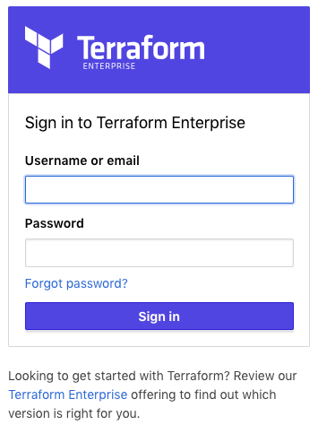
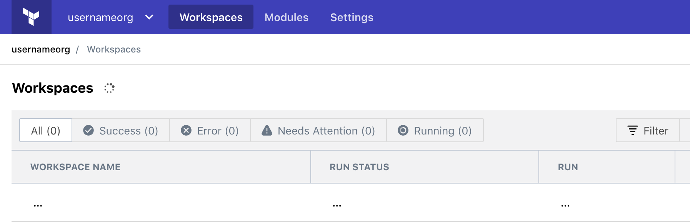
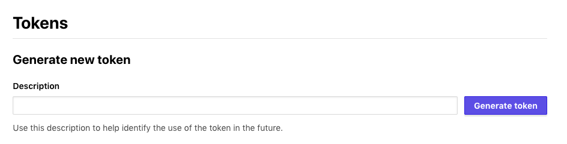

# Terraform Enterprise - API Token Creation

## Expected Outcome

In this challenge, you will create an individual user token for use in future labs.

## How to

### Login

Login to <https://aa-training.digitalinnovation.dev>:

Verify you are part of an Organization:

**IMPORTANT** Take note of you organization name, it can be found in the top left corner of the UI, or in the URL "https://aa-training.digitalinnovation.dev/app/TFE_ORG/workspaces". This will be referenced as your TFE_ORG.

### Generate Token

Navigate to <https://aa-training.digitalinnovation.dev/app/settings/tokens> to generate a token:

Enter a description (i.e. "demo-token") and click "Generate token".

**IMPORTANT** Copy this token locally as you will not be able to retrieve this later. This will be referenced as you API_TOKEN.

## Cleanup

You should now have the following:

* Organization Name
* Api Token
