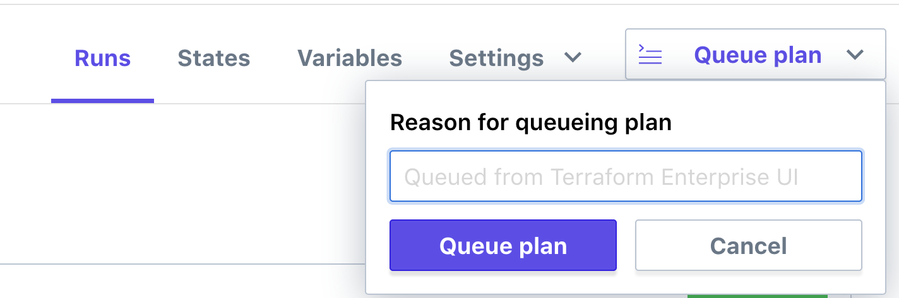

# Terraform Enterprise - Private Module Registry

## Expected Outcome

In this challenge you will register some modules with your Private Module Registry then reference them in a workspace.

## How to:

### Fork the Module Repositories

You are going to fork the following repositories into your own GitHub account:

- https://github.com/azure-terraform-workshop/terraform-azurerm-networking.git
- https://github.com/azure-terraform-workshop/terraform-azurerm-webserver.git
- https://github.com/azure-terraform-workshop/terraform-azurerm-appserver.git
- https://github.com/azure-terraform-workshop/terraform-azurerm-dataserver.git

Each of these repositories represents a module that can be developed and versioned independently.

### Create a new github repository

In github, create a new public repository names "ptfe-workspace-modules".

Create a single `main.tf` file with the following contents:

```hcl
variable "name" {}
variable "location" {}
variable "username" {}
variable "password" {}

variable "vnet_address_spacing" {
  type = "list"
}

variable "subnet_address_prefixes" {
  type = "list"
}

module "networking" {
  source  = "tap-tfe.digitalinnovation.dev/YOUR_ORG_NAME/networking/azurerm"
  version = "0.12.0"

  name                    = var.name
  location                = var.location
  vnet_address_spacing    = var.vnet_address_spacing
  subnet_address_prefixes = var.subnet_address_prefixes
}
```

Update the source arguments to your organization by replacing "YOUR_ORG_NAME" with your TFE organization name.

Commit the file and check the code into github.

### Create a workspace

Create a TFE workspace that uses the VSC connection to load this new repository.


Select the repository and name the workspace the same thing "ptfe-workspace-modules"


### Add Modules

Before we can use our Networking module, we need to add it to the Private Module Registry.

Navigate back to Terraform Enterprise and click the "Modules" menu at the top of the page. From there click the "+ Add Module" button.


Select the networking repository you forked earlier.


> Note: You will see your github user name instead of 'azure-terraform-workshop/' since you forked this repo.

Click "Publish Module".

This will query the repository for necessary files and tags used for versioning.

Congrats, you are done!

Ok, not really...

Repeat this step for the other three modules:

- terraform-azurerm-appserver
- terraform-azurerm-dataserver
- terraform-azurerm-webserver

### Configure Workspace Variables

Navigate back to your "ptfe-workspace-modules" workspace.

Set the Terraform Variables:

- 'name' - A unique environment name such as `myusername`
- 'location' - An Azure region such as `eastus` or `centralus`
- 'username' (sensitive) - A username for the VM's
> Note: this can not be "admin"
- 'password' (sensitive) - A password for the VM's
> NOTE: password must be between 6-72 characters long and must satisfy at least 3 of password complexity requirements from the following:
> 1. Contains an uppercase character
> 2. Contains a lowercase character
> 3. Contains a numeric digit
> 4. Contains a special character
- 'vnet_address_spacing' (HCL) - The Vnet Address space
    ```hcl
    ["10.0.0.0/16"]
    ```
- 'subnet_address_prefixes' (HCL) - The Subnet Address spaces representing 3 subnets
    ```hcl
    [
    "10.0.0.0/24",
    "10.0.1.0/24",
    "10.0.2.0/24",
    ]
    ```

Set Environment Variables for your Azure Service Principal (be sure check the 'sensitive' checkbox to hide these values):

- ARM_TENANT_ID
- ARM_SUBSCRIPTION_ID
- ARM_CLIENT_ID
- ARM_CLIENT_SECRET

### Run a Plan

Click the "Queue Plan" button.



Wait for the Plan to complete.

You should see several additions to deploy your networking.

### Apply the Plan

Approve the plan and apply it.

Watch the apply progress and complete.

Login to the at Azure Portal to see your infrastructure.

### Update a Module

In the `ptfe-workspace-modules` repository, navigate to the `main.tf` file.

Add the following to deploy the rest of your application (again, be sure to update the source references):

```hcl
module "webserver" {
  source  = "tap-tfe.digitalinnovation.dev/YOUR_ORG_NAME/webserver/azurerm"
  version = "0.12.0"

  name      = var.name
  location  = var.location
  subnet_id = module.networking.subnet-ids[0]
  vm_count  = 1
  username  = var.username
  password  = var.password
}

module "appserver" {
  source  = "tap-tfe.digitalinnovation.dev/YOUR_ORG_NAME/appserver/azurerm"
  version = "0.12.0"

  name      = var.name
  location  = var.location
  subnet_id = module.networking.subnet-ids[1]
  vm_count  = 1
  username  = var.username
  password  = var.password
}

module "dataserver" {
  source  = "tap-tfe.digitalinnovation.dev/YOUR_ORG_NAME/dataserver/azurerm"
  version = "0.12.0"

  name      = var.name
  location  = var.location
  subnet_id = module.networking.subnet-ids[2]
  vm_count  = 1
  username  = var.username
  password  = var.password
}
```

Commit your change and see what the changes show in the plan.

If you are satisfied with the changes, apply the changes.

## Advanced areas to explore

1. Make a change to a module repository and tag it in such a way that the change shows in your Private Module Registry.

## Clean Up

Add an Environment variable to your workspace "CONFIRM_DESTROY=1".

Navigate to the workspace "Settings" -> "Destruction and Deletion".

Click Queue Destroy Plan.


Once the plan completes, apply it to destroy your infrastructure.

## Resources

- [Private Registries](https://www.terraform.io/docs/registry/private.html)
- [Publishing Modules](https://www.terraform.io/docs/registry/modules/publish.html)
