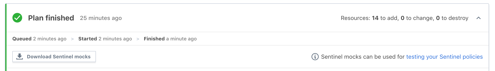

# Terraform Enterprise - Sentinel Development

## Create Folder Structure

Create and change directory into a folder specific to this challenge.

For example: `cd ~/TerraformWorkshop/301-sentinel-development/`.

## Create Sentinel File

Create a new file `azure-restrict-vm-size.sentinel`.

Add imports:

```hcl
import "tfplan"
import "strings"
import "types"
```

Add a list of allowed VM Sizes:

```hcl
allowed_sizes = [
  "Standard_A1",
  "Standard_A2",
  "Standard_D1_v2",
  "Standard_D2_v2",
]
```

Add a helper function that will find all resources of a specific type from all modules using the tfplan import:

```hcl
find_resources_from_plan = func(type) {

  resources = {}

  # Iterate over all modules in the tfplan import
  for tfplan.module_paths as path {
    # Iterate over the named resources of desired type in the module
    for tfplan.module(path).resources[type] else {} as name, instances {
      # Iterate over resource instances
      for instances as index, r {

        # Get the address of the instance
        if length(path) == 0 {
          # root module
          address = type + "." + name + "[" + string(index) + "]"
        } else {
          # non-root module
          address = "module." + strings.join(path, ".module.") + "." + type + "." + name + "[" + string(index) + "]"
        }

        # Add the instance to resources map, setting the key to the address
        resources[address] = r
        print(address) # debug statement
      }
    }
  }

  return resources
}
```

Finally, add a main rule that simply gets all the azure VMs and checks that there is at least one:

```hcl
main = rule {
  length(find_resources_from_plan("azurerm_virtual_machine")) > 0
}
```
## Create a test folder structure

Create a the structure `test/azure-restrict-vm-size`.
Add a single file named `pass.json` in the new directory, with the following contents:

```json
{
  "mock": {
    "tfplan": "mock-tfplan.sentinel"
  },
  "test": {
    "main": true
  }
}
```

Now create a file named `mock-tfplan.sentinel` in the same directory.

## Download a mock

Back in TFE, navigate to the `ptfe-workspace-modules` and click on a run.

Find a run that successfully planned the workspace.
Click the "Download Sentinel Mocks" button.



Once downloaded, extract the contents and find the `tfplan` mock.
Copy the contents into the `mock-tfplan.sentinel` file you created in the last step.

## Run a test

In the `azure-restrict-vm-size.sentinel` file, locate the line:

```hcl
print(address) # debug statement
```

This is there to show how to get information out of a policy while testing.

Run this command: `sentinel test -verbose -run azure-restrict-vm-size.sentinel`

Your output should look something like this:

```sh
PASS - azure-restrict-vm-size.sentinel
  PASS - test/azure-restrict-vm-size/pass.json


    logs:
      module.appserver.azurerm_virtual_machine.module[0]
      module.dataserver.azurerm_virtual_machine.module[0]
      module.webserver.azurerm_virtual_machine.module[0]
    trace:
      TRUE - azure-restrict-vm-size.sentinel:96:1 - Rule "main"
```

Work with that debug statement to play around with the policy.

## Finish the Policy

Add another function to the sentinel policy:

```hcl
validate_attribute_in_list = func(type, attribute, allowed_values) {

	validated = true

	# Get all resource instances of the specified type
	resource_instances = find_resources_from_plan(type)

	# Loop through the resource instances
	for resource_instances as address, r {

		# Skip resource instances that are being destroyed
		# to avoid unnecessary policy violations.
		# Used to be: if length(r.diff) == 0
		if r.destroy {
			print("Skipping resource", address, "that is being destroyed.")
			continue
		}

		# Determine if the attribute is computed
		if r.diff[attribute].computed else false is true {
			print("Resource", address, "has attribute", attribute,
				"that is computed.")
			# If you want computed values to cause the policy to fail,
			# uncomment the next line.
			# validated = false
		} else {
			# Validate that each instance has allowed value
			if (r.applied[attribute] else "") not in allowed_values {
				print("Resource", address, "has attribute", attribute, "with value",
					r.applied[attribute] else "",
					"that is not in the allowed list:", allowed_values)
				validated = false
			}
		}

	}
	return validated
}
```

Update the rule to:

```hcl
main = rule {
	# length(find_resources_from_plan("azurerm_virtual_machine")) > 0
	validate_attribute_in_list("azurerm_virtual_machine", "vm_size", allowed_sizes)
}
```

Run the test again: `sentinel test -verbose -run azure-restrict-vm-size.sentinel`

Success! You now have a valid sentinel policy!

## Extra Credit

### Write another test

Create a new file `test/azure-restrict-vm-size/fail.json`.
Create a new file `test/azure-restrict-vm-size/mock-fail-tfplan.sentintel`.

Update both files to represent a negative test.

### Write another policy

Create a policy, and tests, to compare a VM's location against a blocked list of disallowed locations.

## Resources

- [Sentinel Docs](https://docs.hashicorp.com/sentinel/)
- [Example Azure Policies](https://github.com/hashicorp/terraform-guides/tree/master/governance/second-generation/azure)
- [More Policy Examples](https://github.com/hashicorp/tfe-policies-example)
