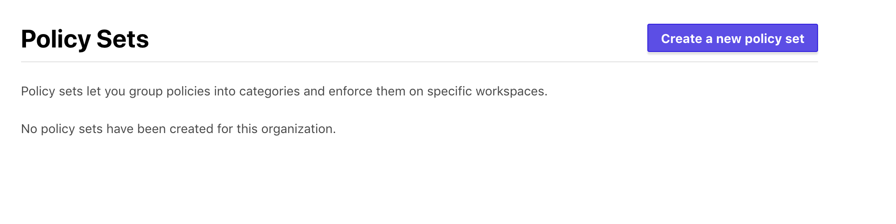

# Terraform Enterprise - Sentinel Policy Use

## Expected Outcome

In this challenge, you will see how you can apply policies around your Azure subscriptions using Sentinel Policies.

## How to

### View Policies

In the Terraform Enterprise web app, click on your organization -> Organization Settings

<https://tap-tfe.digitalinnovation.dev/YOUR_ORG_NAME/settings/policies>


### Create Policy Set

First we need a place to stor our policies, namely a Policy Set.

On the left menu, click the "Policy set" tab.

Click "Create new policy set"



Create the following policy:


Create the following policy:

__Name:__ MyWorkspacePolicies

__Description:__ Policies I use for user 'INSERT USERNAME'.

__Policy Set Source__: Select Upload Via API

__Scope of Policies:__ Select -> "Policies enforced on selected workspaces"

__Policies:__ Select the Policy created above -> Click "Add"

__Workspaces:__ Select the workspace you created in the `301-workspace` lab ("ptfe-workspace") -> Click "Add"

### Create Policy

Now lets create a Policy to enforce governance.

Click "Create new policy"


Create the following policy:

__Policy Name:__ ResourceGroupRequireTag

__Description:__ Policy requiring resource group tags

__Policy Enforcement:__ advisory (logging only)

__Policy Code:__

```hcl
import "tfplan"

required_tags = [
  "owner",
  "environment",
]

getTags = func(group) {
  tags = keys(group.applied.tags)

  for required_tags as t {
    if t not in tags {
      print("Resource Missing Tag:", t)
      return false
    }
  }

  return true
}
main = rule {
  all tfplan.resources.azurerm_resource_group as _, groups {
    all groups as _, group {
      getTags(group)
    }
  }
}
```

__Policy Sets__: Select the Policy Set we just created "MyWorkspacePolicies".

### Run a Plan

> Note: be sure to discard any existing plans.

Navigate to your "ptfe-workspace" and queue a plan.

### Review the Plan

Will see the plan was successful but there was a policy failure, however the option to Apply is still available. Why is that?


**Discard the plan.**

### Update the Policy

Update the Policy Enforcement to be `hard-mandatory`.


### Run a Plan

Queue a plan for the workspace.

### Review the Plan

This time the the run fails due to the hard enforcement.


### Sentinel - Advanced

Create a new Sentinel Policy with following policy:

__Policy Name:__ ResourceGroupRequireTag-Advanced

__Description:__ Policy requiring resource group tags, advanced

__Policy Enforcement:__ hard-mandatory

__Policy Code:__

```hcl
# This policy uses the Sentinel tfplan import to require that all Azure Resource Groups have all mandatory tags.

##### Imports #####

import "tfplan"
import "strings"
import "types"

### List of mandatory tags ###
mandatory_tags = [
  "owner",
  "environment",
]

##### Functions #####

# Find all resources of a specific type from all modules using the tfplan import
find_resources_from_plan = func(type) {

  resources = {}

  # Iterate over all modules in the tfplan import
  for tfplan.module_paths as path {
    # Iterate over the named resources of desired type in the module
    for tfplan.module(path).resources[type] else {} as name, instances {
      # Iterate over resource instances
      for instances as index, r {

        # Get the address of the instance
        if length(path) == 0 {
          # root module
          address = type + "." + name + "[" + string(index) + "]"
        } else {
          # non-root module
          address = "module." + strings.join(path, ".module.") + "." +
                    type + "." + name + "[" + string(index) + "]"
        }

        # Add the instance to resources map, setting the key to the address
        resources[address] = r
      }
    }
  }

  return resources
}

# Validate that all instances of specified type have a specified top-level
# attribute that contains all members of a given list
validate_attribute_contains_list = func(type, attribute, required_values) {

  validated = true

  # Get all resource instances of the specified type
  resource_instances = find_resources_from_plan(type)

  # Loop through the resource instances
  for resource_instances as address, r {

    # Skip resource instances that are being destroyed
    # to avoid unnecessary policy violations.
    # Used to be: if length(r.diff) == 0
    if r.destroy {
      print("Skipping resource", address, "that is being destroyed.")
      continue
    }

    # Determine if the attribute is computed
    # We check "attribute.%" and "attribute.#" because an
    # attribute of type map or list won't show up in the diff
    if (r.diff[attribute + ".%"].computed else false) or
       (r.diff[attribute + ".#"].computed else false) {
      print("Resource", address, "has attribute", attribute,
            "that is computed.")
      # If you want computed values to cause the policy to fail,
      # uncomment the next line.
      # validated = false
    } else {
      # Validate that the attribute is a list or a map
      if length(r.applied[attribute]) else 0 > 0 and
         (types.type_of(r.applied[attribute]) is "list" or
          types.type_of(r.applied[attribute]) is "map") {

        # Evaluate each member of required_values list
        for required_values as rv {
          if r.applied[attribute] not contains rv {
            print("Resource", address, "has attribute", attribute,
                  "that is missing required value", rv, "from the list:",
                  required_values)
            validated = false
          } // end rv
        } // end required_values

      } else {
        print("Resource", address, "is missing attribute", attribute,
              "or it is not a list or a map")
        validated = false
      } // end check that attribute is list or map

    } // end computed check
  } // end resource instances

  return validated
}

### Rules ###

# Call the validation function
tags_validated = validate_attribute_contains_list("azurerm_resource_group",
                 "tags", mandatory_tags)

#Main rule that evaluates results
main = rule {
  tags_validated
}
```

__Policy Sets__: Select the Policy Set "MyWorkspacePolicies".

### Run another plan

We know this will fail due to our first policy, but this advanced policy provides more valuable information to the end user.


### Update Workspace

Update the workspace `main.tf` to comply with the policy failure. What change is required?

Save and commit the code to your repository.

### Run a Plan

Run another plan.

> Note: You may need to discard the last non-applied build.

### Review the Plan

The plan should succeed and now pass the sentinel policy check.

## Advanced areas to explore

1. Write another Sentinel Policy restricting VM types in Azure.

## Resources

- [Policy](https://app.terraform.io/app/cardinalsolutions/settings/policies)
- [Sentinel Language Spec](https://docs.hashicorp.com/sentinel/language/spec)
