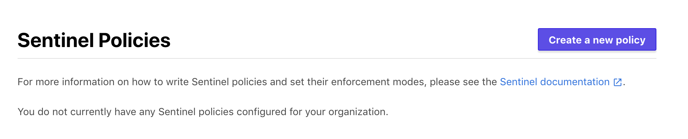
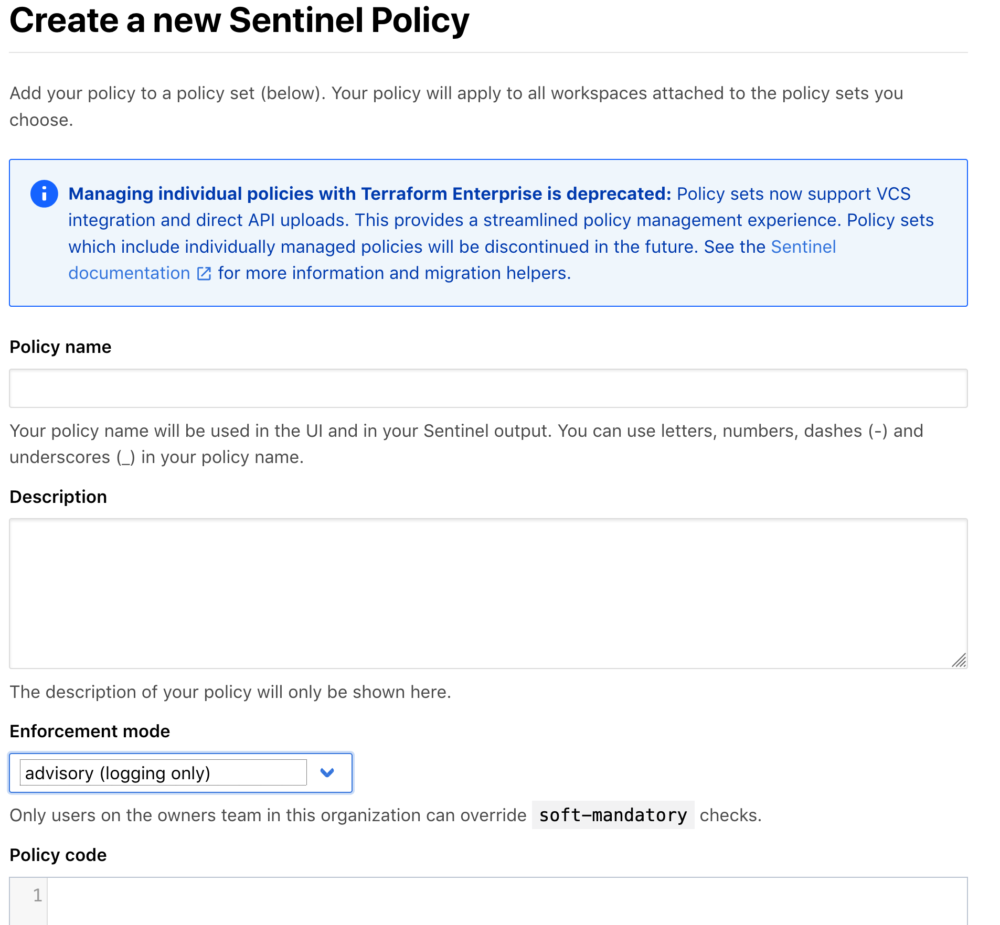
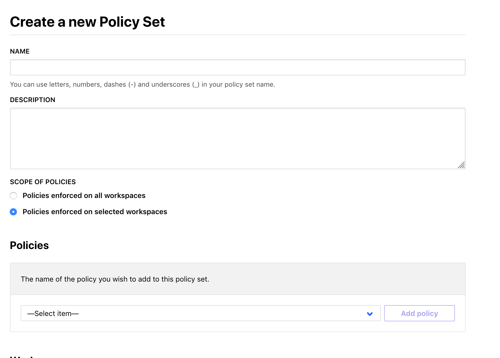

# Terraform Enterprise - Sentinel Policy Use

## Expected Outcome

In this challenge, you will see how you can apply policies around your Azure subscriptions using Sentinel Policies.

## How to

### View Policies

In the Terraform Enterprise web app, click on your organization -> Organization Settings

<https://cmm-training.digitalinnovation.dev/TFE_ORG/settings/policies>



### Create Policy

Click "Create new policy"



Create the following policy:

__Policy Name:__ ResourceGroupRequireTag

__Description:__ Policy requiring resource group tags

__Policy Enforcement:__ advisory (logging only)

__Policy Code:__

```hcl
import "tfplan"

required_tags = [
  "owner",
  "environment",
]

getTags = func(group) {
  tags = keys(group.applied.tags)

  for required_tags as t {
    if t not in tags {
      print("Resource Missing Tag:", t)
      return false
    }
  }

  return true
}
main = rule {
  all tfplan.resources.azurerm_resource_group as _, groups {
    all groups as _, group {
      getTags(group)
    }
  }
}
```

### Create Policy Set

On the left menu, click the "Policy set" tab.

Click "Create new policy set"


Create the following policy:



Create the following policy:

__Name:__ MyWorkspacePolicies

__Description:__ Policies I use for user 'INSERT USERNAME'.

__Scope of Policies:__ Select -> "Policies enforced on selected workspaces"

__Policies:__ Select the Policy created above -> Click "Add"

__Workspaces:__ Select the workspace you created in the `301-workspace` lab ("ptfe-workspace") -> Click "Add"

### Run a Plan

> Note: be sure to discard any existing plans.

Navigate to your "ptfe-workspace" and queue a plan.

### Review the Plan

Will see the plan was successful but there was a policy failure, however the option to Apply is still available.

Discard the plan.

### Update the Policy

Update the Policy Enforcement to be `hard-mandatory`.

### Run a Plan

Queue a plan for the workspace.

### Review the Plan

This time the the run fails due to the hard enforcement.


### Update Workspace

Update the workspace `main.tf` to comply with the policy failure. What change is required?

Save and commit the code to your repository.

### Run a Plan

Run another plan.

> Note: You may need to discard the last non-applied build.

### Review the Plan

The plan should succeed and now pass the sentinel policy check.

## Advanced areas to explore

1. Write another Sentinel Policy restricting VM types in Azure.

## Resources

- [Policy](https://app.terraform.io/app/cardinalsolutions/settings/policies)
- [Sentinel Language Spec](https://docs.hashicorp.com/sentinel/language/spec)
- [Example Azure Policies](https://github.com/hashicorp/terraform-guides/tree/master/governance/first-generation/azure)
