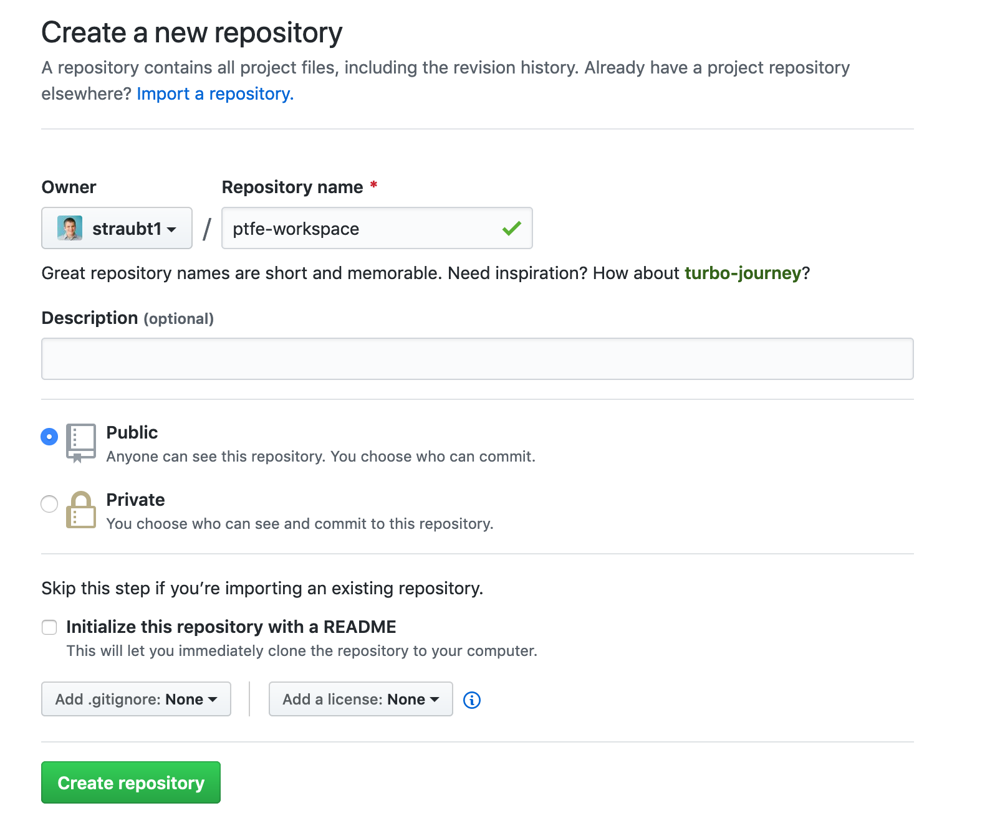
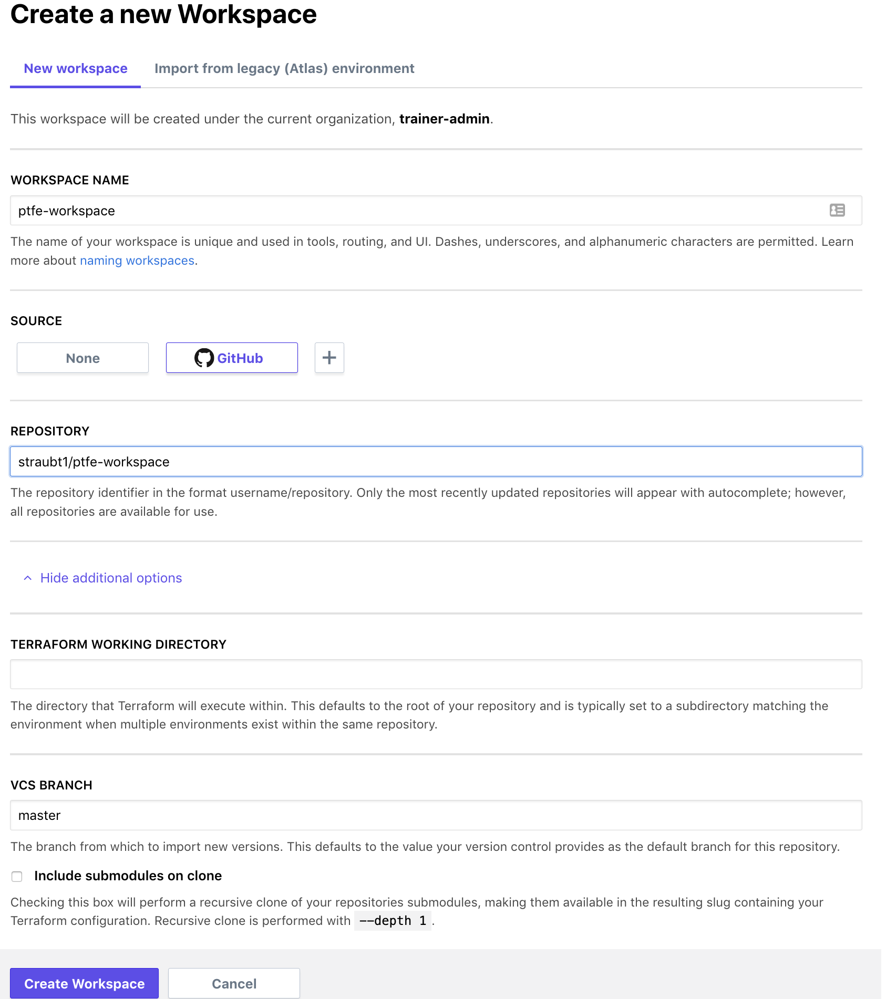
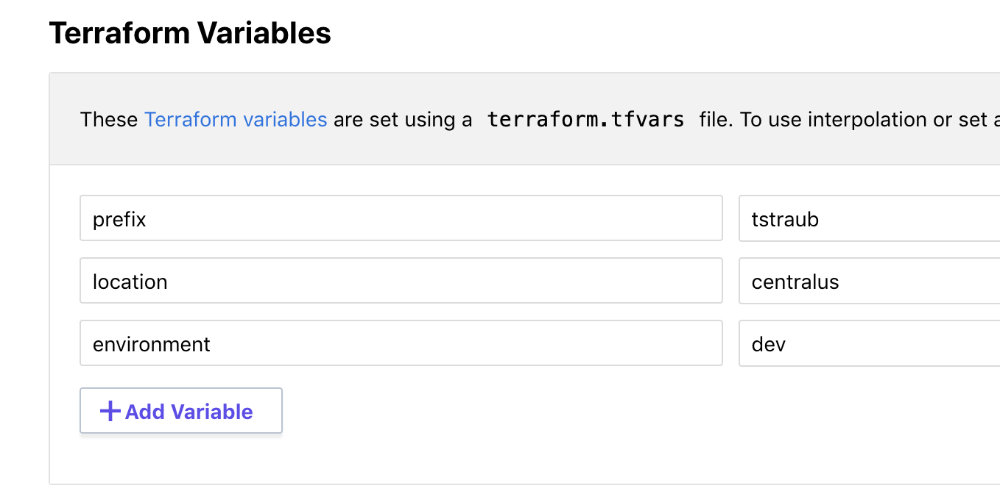
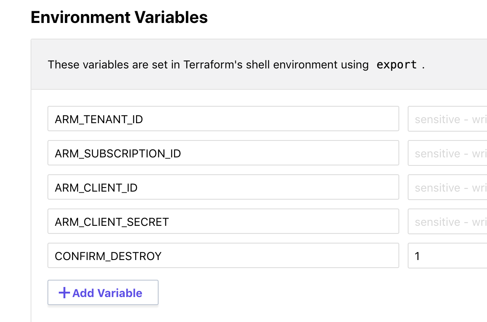
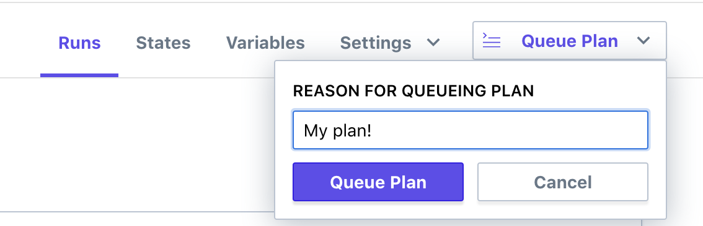

# Terraform Enterprise - Workspaces

## Expected Outcome

In this challenge, you will create a repository and workspaces.

## How to

### Create a new github repository

Login to github and create a new repository by navigating to <https://github.com/new>.

Use the following settings:
- `name` = "ptfe-workspace"
- Public repo
- Check "Initialize this repository with a README"
- Add `.gitignore` of type "Terraform"



Once created, clone the repository to your local machine.

### Create a TFE Workspace

Login to TFE and click the "+ New Workspace" button.

Select the VCS Connection to github.

In the repository section, enter the name of the repository you created above.

Click the advanced dropdown and enter the "VCS Branch" as "master".



### Update your repository

In your repository, create a `main.tf` file with the following contents:

```hcl
variable "prefix" {}
variable "environment" {}
variable "location" {}

resource "azurerm_resource_group" "main" {
  name     = "${var.prefix}-tfe-rg"
  location = "${var.location}"

  tags = {
    "environment" = "${var.environment}"
  }
}
```

Commit the changes:

```sh
git add *
git commit -m "Initial"
git push origin master
```

### TFE Workspace Variables

Back in your TFE Workspace, navigate to your workspace.

Go to the "Variables" tab.

Enter the following variables in the Terraform Variables section:

- "prefix" = "<insert your username>"
- "environment" = "dev"
- "location" = "centralus"



Enter the following variables in the Environments Variables section:

- ARM_TENANT_ID =
- ARM_SUBSCRIPTION_ID =
- ARM_CLIENT_ID =
- ARM_CLIENT_SECRET =
- CONFIRM_DESTROY = 1

> Note: You will get these credentials from your system admin.



### Queue a Plan



### Apply

Confirm the plan, but clicking "Confirm & Apply".

Navigate to the portal to see your infrastructure.

### Extra Credit

1. Find the workspace id (hint: it will start with "ws-").
2. Trigger a Workspace Run via the HTTP call (hint: Check the docs [here](https://www.terraform.io/docs/cloud/api/run.html#sample-request)).
